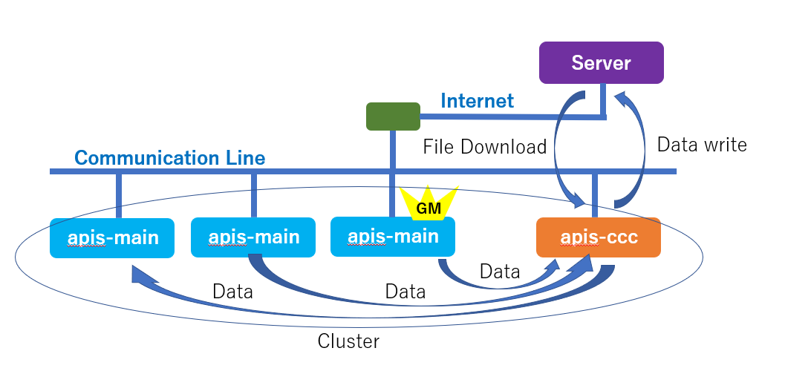
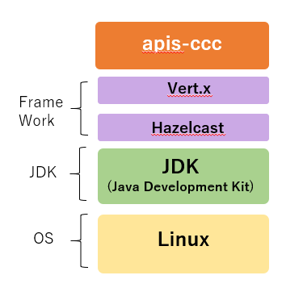
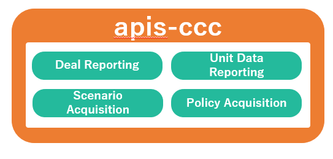
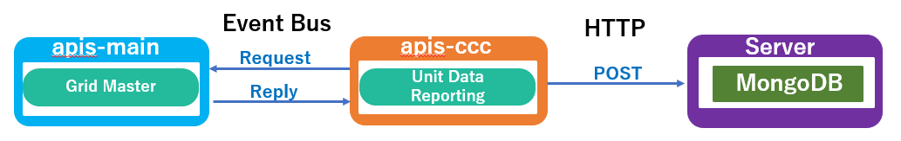
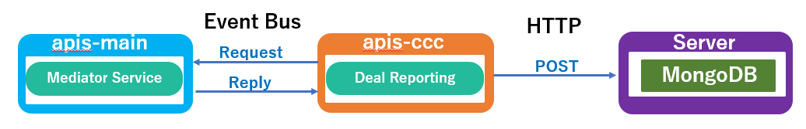
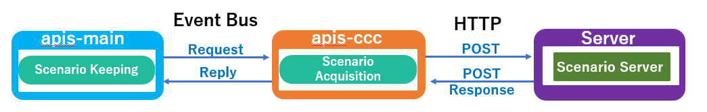
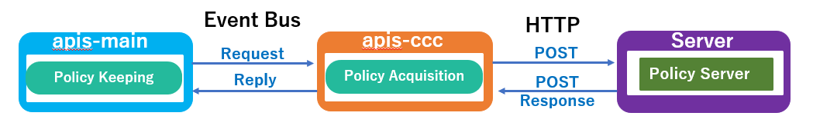

**apis-ccc Specification Document**
=====
**Rev 0.63**

# **Contents**
- [**apis-ccc Specification Document**](#apis-ccc-specification-document)
- [**Contents**](#contents)
- [**1. Terms and Abbreviations**](#1-terms-and-abbreviations)
- [**2. Overview**](#2-overview)
- [**3. Software Composition**](#3-software-composition)
  - [**3.1. Software Architecture**](#31-software-architecture)
  - [**3.2. .apis-ccc Services**](#32-apis-ccc-services)
- [**4. Detailed Description of Actions**](#4-detailed-description-of-actions)
  - [**4.1. Unit Data Reporting**](#41-unit-data-reporting)
  - [**4.2. Deal Reporting**](#42-deal-reporting)
  - [**4.3. Scenario Acquisition**](#43-scenario-acquisition)
  - [**4.4. Policy Acquisition**](#44-policy-acquisition)
- [**5. Data Acquisition**](#5-data-acquisition)
  - [**5.1. Data Acquired by Unit Data Reporting**](#51-data-acquired-by-unit-data-reporting)
  - [**5.2. Data Acquired by Deal Reporting**](#52-data-acquired-by-deal-reporting)
- [**6. Configuration Files**](#6-configuration-files)
  - [**6.1. config.json**](#61-configjson)
  - [**6.2. cluster.xml**](#62-clusterxml)
  - [**6.3. logging.properties**](#63-loggingproperties)
  - [**6.4. start.sh**](#64-startsh)
  - [**6.5. stop-kill.sh**](#65-stop-killsh)
  - [**6.6. key.pem**](#66-keypem)
  - [**6.7. cert.pem**](#67-certpem)
- [**7. Logging Functions**](#7-logging-functions)
  - [**7.1.Log Level**](#71log-level)
  - [**7.2. Output Destinations of APIS Action Logs**](#72-output-destinations-of-apis-action-logs)
- [**8. Error Handling**](#8-error-handling)
- [**9. Security**](#9-security)
  - [**9.1. Inter-APIS Communication Security**](#91-inter-apis-communication-security)
- [**10. Privacy**](#10-privacy)
- [**11. OPEN-SOURCE Software Licenses**](#11-open-source-software-licenses)
- [**12. Operating Environment**](#12-operating-environment)
  - [**12.1. Recommended Hardware Specifications**](#121-recommended-hardware-specifications)
  - [**12.2. Recommended Operating System Specifications**](#122-recommended-operating-system-specifications)

 

# **1. Terms and Abbreviations**

<table>
<thead>
<tr class="header">
<th><strong>Term</strong></th>
<th><strong>Explanation</strong></th>
</tr>
</thead>
<tbody>
<tr class="odd">
<td>apis-main</td>
<td>Software developed by Sony CSL for energy sharing that enables autonomous decentralized control. (For more information, refer to the apis-main Specification Document.)</td>
</tr>
<tr class="even">
<td>Grid Master</td>
<td>Name of a service included in apis-main. Controls the DC grid for energy sharing.</td>
</tr>
<tr class="odd">
<td>Mediator Service</td>
<td>A service that negotiates for the services of an apis-main with the Mediator Services of other apis-main and activates the Grid Master that creates energy sharing data.</td>
</tr>
<tr class="even">
<td>Hazelcast</td>
<td>An in-memory distributed computing library that accelerates applications by distributing data across multiple machines and conducting parallel processing.</td>
</tr>
<tr class="odd">
<td>Vert.x</td>
<td>A framework for program load balancing. The Hazelcast library is used for event bus clustering and load-balancing on the network.</td>
</tr>
<tr class="even">
<td>Event Bus</td>
<td>The basic processing unit of a Vert.x program is called a verticle. The event bus is an asynchronous interface for verticle-to-verticle communications.</td>
</tr>
<tr class="odd">
<td>Scenario</td>
<td>This is a file in JSON format that describes the charging or discharging requirements for the state of charge of each battery required for energy sharing.</td>
</tr>
<tr class="even">
<td>Policy</td>
<td>This is a file in JSON format that is used by apis-main and sets the parameters that are required for safe execution of the control algorithms that are needed for maintaining overall operational order.</td>
</tr>
</tbody>
</table>

 

# **2. Overview**

apis-ccc is client software for uploading information that is related to energy sharing to external services such as a server and downloading node configuration files from a server for operation and maintenance. It constructs clusters by using the functions of the Vert.x and Hazelcast frameworks to obtain information from apis-main that is running on multiple nodes that are connected via Ethernet or other communication lines. From the Grid Master in the cluster, it then obtains information on the hardware of each node, software information related to apis-main, and node-specific information. In that way, information on any node can be obtained. apis-ccc also has a function for downloading configuration files upon request from apis-main.

  
Figure 2-1

 

# **3. Software Composition**

## **3.1. Software Architecture**

The apis-ccc software architecture is illustrated in Figure 3-1. apis-ccc runs on two frameworks, the Vert.x event-driven load distribution platform and the Hazelcast in-memory distributed computing framework. Both frameworks run on top of the Java Development Kit (JDK) on Linux. (Operation has been confirmed on the OSS software version 12. Refer to the OSS license.)

  
Figure 3-1

 

## **3.2. .apis-ccc Services**

The four services provided by apis-ccc (Figure 3-2) are described below.

1)  Unit Data Reporting  
  This service collects information from Grid Master at regular intervals, including hardware information such as the DC/DC converter and battery of each node and software information that is related to apis-main, etc., and node-specific information. It sends that information to external services such as a server.

3)  Deal Reporting  
  This service collects information on total energy sharing from any Mediator Service and sends that information to external services such as a server. (The Mediator Service is selected by Vert.x.)

5)  Scenario Acquisition  
  This service collects scenario files from a server or other external services according to periodic accesses from apis-mains and sends the files to the requesting apis-mains.

4)  Policy Acquisition  
  This service collects policy files from a server or other external services according to periodic accesses from the apis-mains and sends the files to the requesting apis-mains.

  
Figure 3-2

 

# **4. Detailed Description of Actions**
    
## **4.1. Unit Data Reporting**

The Unit Data Reporting apis-ccc service sends requests via the event bus to Grid Master, which is a service of apis-main, at intervals of unitDataReporting.periodMsec to obtain software and hardware information for all nodes and node-specific information in JSON format. (See section 6.1, “config.json”.) The obtained information is sent in JSON format by the HTTP POST method to external services such as a server, where it is stored in a MongoDB database. (Concerning hardware information, see section 5.1, “Data Acquired by Unit Data Reporting”.)

  
Figure 4-1

 

## **4.2. Deal Reporting**

The Deal Reporting apis-ccc service sends requests via the event bus to a Mediator Service, which is a service of apis-main, at intervals of dealReporting.periodMsec (see section 6.1, “config.json”) to obtain energy sharing data in JSON format. The obtained information is sent in JSON format by the HTTP POST method to external services such as a server, where it is stored in MongoDB. (The Mediator Service is specified by Vert.x. It obtains all energy sharing data from memory that is shared with Hazelcast and sends the data to the Deal Reporting service.)

Separately from the periodic Deal Reporting processing, the Mediator Services of the participating apis-mains apply a trigger when the energy sharing is completed to execute processing that saves the energy sharing completion data to the MongoDB database via the Deal Reporting service.

  
Figure 4-2

 

## **4.3. Scenario Acquisition**

The apis-ccc Scenario Acquisition service receives requests for scenario files from the Scenario Keeping service of the apis-main User Service via the event bus at intervals specified in the scenario files. The requests are sent together with the service ID and other such information. The Scenario Acquisition service that has received the request sends that information to a server or other such external service by the HTTP POST method. The service that receives the information matches the ID and other information and returns a scenario file in JSON format in the HTTP POST response to the Scenario Acquisition service. Upon receiving the response, the Scenario Acquisition service sends the scenario file in JSON format to the requesting Scenario Keeping service via the event bus.

  
Figure 4-3

 

## **4.4. Policy Acquisition**

The apis-ccc Policy Acquisition service receives requests for scenario files from the Policy Keeping service of the apis-main User Service via the event bus at intervals specified in the Policy files. The requests are sent together with the service ID and other such information. The Policy Acquisition service that has received the request sends that information to a server or other such external service by the HTTP POST method. The service that receives the information matches the ID and other information and returns a scenario file in JSON format in the HTTP POST response to the Policy Acquisition service. Upon receiving the response, the Policy Acquisition service sends the scenario file in JSON format to the requesting Policy Keeping service via the event bus. Because the same policy file must be used for the entire cluster, it is necessary to prevent changes to the policy file by the apis-main programs of different nodes. For that reason, it is implemented as a function, and the administrator must temporarily halt automatic interchange within the cluster and perform it as a maintenance task.

  
Figure 4-4

 

# **5. Data Acquisition**
    
## **5.1. Data Acquired by Unit Data Reporting**

The hardware information for each node that is obtained from the Grid Master by the Unit Data Reporting service via the event bus is described below. The items of information are obtained as a single set for all nodes.

<table>
<tbody>
<tr class="even">
<td rowspan="6">apis</td>
<td>version</td>
<td>apis-main version</td>
</tr>
<tr class="odd">
<td>remaining_capacity_wh</td>
<td>Battery state of charge (Wh)</td>
</tr>
<tr class="even">
<td>deal_interlock_capacity</td>
<td>The number of slots that can carry out interchanges simultaneously when one slot is set for one interchange</td>
</tr>
<tr class="odd">
<td>operation_mode.global</td>
<td>
Set operation mode of clusters globally.

autonomous:

&emsp;Usual energy sharing mode

heteronomous:

&emsp;Continue existing energy sharings.

&emsp;Disable generation of new energy sharings.

stop: Energy sharing is stopped

manual: Manual mode (for testing)
</td>
</tr>
<tr class="even">
<td>operation_mode.local</td>
<td>
Set the operation mode for a node.

&lt;Empty&gt;:

&emsp;According to operation_mode.global

heteronomous:

&emsp;Continue existing energy sharing.

&emsp;Disable generation of new energy sharings.

stop:

&emsp;Energy sharing is stopped.
</td>
</tr>
<tr class="odd">
<td>operation_mode.effective</td>
<td>
Effective operation mode

Determined by combining global and local operation modes
</td>
</tr>
<tr class="even">
<td rowspan="10">oesunit</td>
<td>communityId</td>
<td>The community ID</td>
</tr>
<tr class="odd">
<td>clusterId</td>
<td>The cluster ID</td>
</tr>
<tr class="even">
<td>id</td>
<td>The node ID</td>
</tr>
<tr class="odd">
<td>display</td>
<td>The node name</td>
</tr>
<tr class="even">
<td>sn</td>
<td>The node serial number</td>
</tr>
<tr class="odd">
<td>budo</td>
<td>
In the previous system, this flag was used to indicate that automatic interchange is active. In the current system, this flag is used to indicate whether or not operation_mode.effective is autonomous.

Autonomous: 1

Otherwise: 0
</td>
</tr>
<tr class="even">
<td>ip</td>
<td>IPv4</td>
</tr>
<tr class="odd">
<td>Ipv6_ll</td>
<td>IPv6 link-local unicast address</td>
</tr>
<tr class="even">
<td>Ipv6_g</td>
<td>IPv6 global unicast address</td>
</tr>
<tr class="odd">
<td>mac</td>
<td>MAC address</td>
</tr>
<tr class="even">
<td rowspan="2">battery</td>
<td>rsoc</td>
<td>Relative state of charge (%)</td>
</tr>
<tr class="odd">
<td>battery_operation_status</td>
<td>Flag that indicates whether or not energy sharing is possible</td>
</tr>
<tr class="even">
<td colspan="2">time</td>
<td>apis-main node time</td>
</tr>
<tr class="odd">
<td rowspan="21">dcdc</td>
<td>status.status</td>
<td>The status</td>
</tr>
<tr class="even">
<td>status.alarm</td>
<td>Alarm number</td>
</tr>
<tr class="odd">
<td>status.stateAlarm</td>
<td>Alarm information</td>
</tr>
<tr class="even">
<td>status.statusName</td>
<td>DC/DC converter status name</td>
</tr>
<tr class="odd">
<td>status.runningState</td>
<td>DC/DC converter running status</td>
</tr>
<tr class="even">
<td>status.operationMode</td>
<td>The operation mode</td>
</tr>
<tr class="odd">
<td>meter.wb</td>
<td>DC Grid power (W)</td>
</tr>
<tr class="even">
<td>meter.vg</td>
<td>DC Grid voltage (V)</td>
</tr>
<tr class="odd">
<td>meter.ig</td>
<td>DC Grid current (A)</td>
</tr>
<tr class="even">
<td>meter.wb</td>
<td>Battery power (W)</td>
</tr>
<tr class="odd">
<td>meter.vb</td>
<td>Battery voltage (V)</td>
</tr>
<tr class="even">
<td>meter.ib</td>
<td>Battery current (A)</td>
</tr>
<tr class="odd">
<td>meter.tmp</td>
<td>Internal temperature (℃)</td>
</tr>
<tr class="even">
<td>vdis.dvg</td>
<td>DC grid target voltage (V)</td>
</tr>
<tr class="odd">
<td>vdis.drg</td>
<td>DC grid droop rate (%)</td>
</tr>
<tr class="even">
<td>param.dig</td>
<td>DC grid upper-limit current (A)</td>
</tr>
<tr class="odd">
<td>param.ogv</td>
<td>DC grid excess voltage threshold (V)</td>
</tr>
<tr class="even">
<td>param.ugv</td>
<td>DC grid low voltage threshold (V)</td>
</tr>
<tr class="odd">
<td>param.cib</td>
<td>Battery upper-limit current (A)</td>
</tr>
<tr class="even">
<td>param.obv</td>
<td>Battery excess voltage threshold (V)</td>
</tr>
<tr class="odd">
<td>param.ubv</td>
<td>Battery low voltage threshold (V)</td>
</tr>
</tbody>
</table>

 

## **5.2. Data Acquired by Deal Reporting**

The hardware information of each node that the Deal Reporting service acquires from Grid Master via the event bus is described below. The hardware information for all nodes can be acquired as a single set.

<table>
<thead>
<tr class="header">
<th>unitId</th>
<th>Node ID</th>
</tr>
</thead>
<tbody>
<tr class="odd">
<td>negotiationId</td>
<td>Energy sharing negotiation ID</td>
</tr>
<tr class="even">
<td>requestUnitId</td>
<td>ID of node that requested the energy sharing</td>
</tr>
<tr class="odd">
<td>acceptUnitId</td>
<td>ID of node that accepted the energy sharing</td>
</tr>
<tr class="even">
<td>requestDateTime</td>
<td>Date and time of energy sharing request</td>
</tr>
<tr class="odd">
<td>acceptDateTime</td>
<td>Date and time of energy sharing acceptance</td>
</tr>
<tr class="even">
<td>requestPointPerWh</td>
<td>Points per watt-hour presented by the requesting side</td>
</tr>
<tr class="odd">
<td>acceptPontPerWh</td>
<td>Points per watt-hour presented by the accepting side</td>
</tr>
<tr class="even">
<td>requestDealGridCurrentA</td>
<td>Value of the current in the energy sharing presented by the requesting side</td>
</tr>
<tr class="odd">
<td>acceptDealGridCurrentA</td>
<td>Value of the current in the energy sharing presented by the accepting side</td>
</tr>
<tr class="even">
<td>type</td>
<td>Type of energy sharing request (Charge/Discharge)</td>
</tr>
<tr class="odd">
<td>chargeUnitId</td>
<td>ID of charging node</td>
</tr>
<tr class="even">
<td>dischargeUnitId</td>
<td>ID of discharging node</td>
</tr>
<tr class="odd">
<td>pointPerWh</td>
<td>Points per watt-hour during actual energy sharing</td>
</tr>
<tr class="even">
<td>chargeUnitEfficientGridVoltageV</td>
<td>Efficient grid voltage of charging node</td>
</tr>
<tr class="odd">
<td>dischargeUnitEfficientGridVoltageV</td>
<td>Efficient grid voltage of discharging node</td>
</tr>
<tr class="even">
<td>dealGridCurrentA</td>
<td>Current value (A) during energy sharing</td>
</tr>
<tr class="odd">
<td>requestAmountWh</td>
<td>Electrical energy presented by the requesting side</td>
</tr>
<tr class="even">
<td>acceptAmountWh</td>
<td>Electrical energy presented by the accepting side</td>
</tr>
<tr class="odd">
<td>dealAmountWh</td>
<td>Electrical energy (Wh) during energy sharing</td>
</tr>
<tr class="even">
<td>dealId</td>
<td>ID assigned to energy sharing information</td>
</tr>
<tr class="odd">
<td>createDateTime</td>
<td>Date and time when the energy sharing information was created</td>
</tr>
<tr class="even">
<td>
compensationTargetVoltage

ReferenceGridCurrentA
</td>
<td>Target value (A) of current compensation at the voltage reference node</td>
</tr>
<tr class="odd">
<td>activateDateTime</td>
<td>Date and time when the constant voltage node starts up</td>
</tr>
<tr class="even">
<td>rampUpDateTime</td>
<td>Date and time when DC grid voltage ramp-up is complete</td>
</tr>
<tr class="odd">
<td>warmUpDateTime</td>
<td>Date and time when the constant current node starts up</td>
</tr>
<tr class="even">
<td>
dischargeUnitCompensated

GridCurrentA
</td>
<td>Discharge current (A) after current compensation</td>
</tr>
<tr class="odd">
<td>
chargeUnitCompensated

GridCurrentA
</td>
<td>Charge current (A) after current compensation</td>
</tr>
<tr class="even">
<td>startDateTime</td>
<td>Date and time when actual energy sharing begins</td>
</tr>
<tr class="odd">
<td>cumulateDateTime</td>
<td>Date and time when interchanged power actually accumulates</td>
</tr>
<tr class="even">
<td>cumulateAmountWh</td>
<td>Total electrical power (watt-hour) after actual energy sharing</td>
</tr>
<tr class="odd">
<td>stopDateTime</td>
<td>Date and time when actual energy sharing stops</td>
</tr>
<tr class="even">
<td>deactiveateDateTime</td>
<td>Date and time when post-energy sharing processing is complete</td>
</tr>
</tbody>
</table>

 

# **6. Configuration Files**

The various apis-ccc configuration files and key files are described below.

## **6.1. config.json**

The following basic information for configuring apis-ccc is set in a JSON-format file. The file is read once when apis-ccc starts up, so if a parameter is changed, apis-ccc must be restarted.

<table>
<body>
<tr class="even">
<td>programId</td>
<td>Program identification string</td>
</tr>
<tr class="odd">
<td>comminityId</td>
<td>Community identification string; higher-level ID when organizing more than one cluster. Also used as an encryption seed, together with clusterId and the apis-main version string.</td>
</tr>
<tr class="even">
<td>clusterId</td>
<td>Cluster identification string; used as an encryption seed, together with communityId and the apis-main version string.</td>
</tr>
<tr class="odd">
<td>security.enabled</td>
<td>Setting for enabling/disabling encryption of shared memory and using SSL for the event bus</td>
</tr>
<tr class="even">
<td>security.pemKeyFile</td>
<td>Secret key used for event bus SSL</td>
</tr>
<tr class="odd">
<td>security.pemCertFile</td>
<td>Certificate used for event bus SSL</td>
</tr>
<tr class="even">
<td>
dealReporting.

periodMsec
</td>
<td>The period for reporting energy sharing information to a server or other external services</td>
</tr>
<tr class="odd">
<td>dealReporting.host</td>
<td>The IP address of the external server or other service that sends the energy sharing data</td>
</tr>
<tr class="even">
<td>dealReporting.port</td>
<td>The port number of the external server or other service that sends the energy sharing data</td>
</tr>
<tr class="odd">
<td>dealReporting.ssl</td>
<td>
The state of SSL communication for the external server or other service that sends the energy sharing data

&emsp;Enabled: True

&emsp;Disabled: False
</td>
</tr>
<tr class="even">
<td>dealReporting.uri</td>
<td>The URI of the external server or other service that sends the energy sharing data</td>
</tr>
<tr class="odd">
<td>
dealReporting.request

TimeoutMsec
</td>
<td>The timeout time for HTTP requests of the external server or other service that sends the energy sharing data</td>
</tr>
<tr class="even">
<td>
unitDataReporting

.periodMsec
</td>
<td>The period for reporting hardware data to the external server or other service that sends the hardware data</td>
</tr>
<tr class="odd">
<td>unitDataReporting.host</td>
<td>The IP address of the external server or other service that sends the hardware data</td>
</tr>
<tr class="even">
<td>unitDataReporting.port</td>
<td>The port number of the external server or other service that sends the hardware data</td>
</tr>
<tr class="odd">
<td>unitDataReporting.ssl</td>
<td>
The state of SSL communication for the external server or other service that sends the hardware data

&emsp;Enabled: True

&emsp;Disabled: False
</td>
</tr>
<tr class="even">
<td>unitDataReporting.uri</td>
<td>The URI of the external server or other service that sends the hardware data</td>
</tr>
<tr class="odd">
<td>
unitDataReporting.

requestTimeoutMsec
</td>
<td>The timeout time for HTTP requests of the external server or other service that sends the hardware data</td>
</tr>
<tr class="even">
<td>scenarioAcquisition.host</td>
<td>The IP address of the external server or other service that acquires the scenario file</td>
</tr>
<tr class="odd">
<td>scenarioAcquisition.port</td>
<td>The port number of the external server or other service that acquires the scenario file</td>
</tr>
<tr class="even">
<td>scenarioAcquisition.ssl</td>
<td>
The state of SSL communication for the external server or other service that acquires the scenario file.

&emsp;Enabled: True

&emsp;Disabled: False
</td>
</tr>
<tr class="odd">
<td>scenarioAcquisition.uri</td>
<td>The reporting URI of the external server or other service that acquires the scenario file</td>
</tr>
<tr class="even">
<td>
scenarioAcquisition.

requestTimeoutMsec
</td>
<td>The timeout time for HTTP requests of the external server or other service that acquires the scenario file</td>
</tr>
<tr class="odd">
<td>policyAcquisition.host</td>
<td>The IP address of the external server or other service that acquires the policy file</td>
</tr>
<tr class="even">
<td>policyAcquisition.port</td>
<td>The port number of the external server or other service that acquires the policy file</td>
</tr>
<tr class="odd">
<td>policyAcquisition.ssl</td>
<td>
The state of SSL communication for the external server or other service that acquires the policy file.

&emsp;Enabled: True

&emsp;Disabled: False
</td>
</tr>
<tr class="even">
<td>policyAcquisition.uri</td>
<td>The reporting URI of the external server or other service that acquires the policy file</td>
</tr>
<tr class="odd">
<td>
policyAcquisition.request

TimeoutMsec
</td>
<td>The timeout time for HTTP requests of the external server or other service that acquires the policy file</td>
</tr>
<tr class="even">
<td>watchdog.periodMsec</td>
<td>Watchdog reset period (ms)</td>
</tr>
<tr class="odd">
<td>watchdog.host</td>
<td>IP address accessed by the watchdog service at the interval specified by periodMsec</td>
</tr>
<tr class="even">
<td>watchdog.port</td>
<td>Port number accessed by the watchdog service at the interval specified by periodMsec</td>
</tr>
<tr class="odd">
<td>watchdog.uri</td>
<td>Watchdog service URI</td>
</tr>
<tr class="even">
<td>
watchdog.request

TimeoutMsec
</td>
<td>Timeout of the watchdog service (ms)</td>
</tr>
</tbody>
</table>

 

## **6.2. cluster.xml**

This file contains the parameter settings that are required for construction of Hazelcast clusters in XML format (cluster name, password, network settings, multicast settings, etc.).

The file is encrypted for storage as cluster.xml.encrypted.

 

## **6.3. logging.properties**

This file contains settings that are related to log output of the standard java.util.logging API (log file location, log capacity, logging level, etc.).

 

## **6.4. start.sh**

This shell script is executed automatically to start up apis-ccc when the OS boots up.  
The command in start.sh that starts up apis-ccc is shown below.  

 

 > java -Djava.net.preferIPv4Stack=true -Duser.timezone=Asia/Tokyo -Djava.util.logging.config.file=./logging.properties -jar ./apis-ccc-2.23.0-a01-fat.jar -conf ./config.json -cp ./ -cluster -cluster-host 127.0.0.1 &  

 

The arguments that follow ‘java’ in the command are explained below.  

* Djava.net.preferIPv4Stack=true  
 \-\> Option for binding to an IPv4 address

* Duser.timezone=Asia/Tokyo  
 \-\> Time zone setting

* Djava.util.logging.config.file=./logging.properties  
 \-\> Option for specifying the log configuration file

* jar ./apis-ccc-2.23.0-a01-fat.jar  
 \-\> Option for specifying execution of the program encapsulated in a JAR file

* conf ./config.json  
 \-\> Option for specifying the configuration file

* cp ./  
 \-\> Option for specifying the location of the cluster.xml file

* cluster-host 127.0.0.1  
 \-\> Option for specifying the local IP Address

 

## **6.5. stop-kill.sh**

This file holds a shell script that stops execution of the apis-ccc process.  
After executing the shutdown function (stop) via the event bus, the script forcefully terminates its own Java process when a timeout occurs. The timeout time can be set in units of seconds within the script.  

 

## **6.6. key.pem**

This is the secret key used for SSL protection of the event bus.

 

## **6.7. cert.pem**

This is the certificate used for SSL protection of the event bus.

 

# **7. Logging Functions**
    
## **7.1.Log Level**

The standard Java java.util.logging API is used for logging. Of the seven available log levels described below, the “CONFIG” and “FINER” levels are not used for APIS. The APIS operation logs are described in the logging.properties file, where the log file location, log levels, maximum log size, and maximum number of logs are set.

\[java.util.logging Log Level\]

1.  SEVERE
  * This level is used when an execution error occurs.  
   Log output at this level can be considered an indication that a problem has occurred.  
     * \< Example \> 
       * Communication with an external server has failed.

2.  WARNING
  *  This level is used to issue a warning when there is unexpected behavior that is not an execution error.  
     *  \< Example \> 
        *  The hardware data on each node in the response from the Grid Master is empty.

3.  INFO
  *  This level is used to output information during normal execution. For apis-ccc, it is used when event processing that is particularly important to operation is performed.
     *  \< Example \> 
        *  Connection information for a server or other external service

4.  CONFIG
  *  This level relates to configuration settings, but is not output for apis-ccc.

6.  FINE
  *  This level is used for output of ordinary operation information during normal system operation.
     *  \< Example \> 
        *  Information to be sent to a server or other external services

6.  FINER
  *  This level is for information related to the starting and stopping of specific processes, but is not output for apis-ccc.

8.  FINEST
  *   This level is used for output of ordinary operation information during normal system operation.
      *   \< Example \> 
          *   When Vert.x Verticle is started up, etc.

 

## **7.2. Output Destinations of APIS Action Logs**

The apis-ccc operation logs are output to three destinations: UDP, console, and file. The log output destinations and output levels can be set in the logging.properties file. UDP is used for security of data output to the communication line and line traffic. Output to file should be considered for the capacity of non-volatile storage.

 

# **8. Error Handling**

When a problem occurs, the log is output to file, UDP, and console, but there is no function for the process to reset or stop itself.

 

# **9. Security**
    
## **9.1. Inter-APIS Communication Security**

The apis-ccc and the Grid Master communicate via the event bus and Hazelcast communication supported by the Vert.x and Hazelcast frameworks. For security, communication by both methods is encrypted by the methods listed below.

(1) Event bus communication

* SSL public-key cryptography (RSA)
* SSL self-signed certificate

(2) Hazelcast communication

* Shared-key cryptography (128-bit AES)

 

# **10. Privacy**

It is necessary to check whether or not the information that can be obtained via apis-ccc is personal information, because what is considered to be personal information varies with the region of introduction. Caution is required, because the act of sending personal information to an external server without the permission of the information owner may be subject to personal information protection regulations such as GDPR.

 

# **11. OPEN-SOURCE Software Licenses**

The software used by apis-ccc and the relevant open-source software licensing information is listed in the table below. Because Adopt OpenJDK is used by apis-ccc only as a linked library, it is not necessary to open the apis-ccc source code, even under GPL v2 with Classpath Exception applied. For the other software, also, no license requires the apis-ccc source code to be published.

■ Open-source software licensing of software used by apis-ccc

<table>
<thead>
<tr class="header">
<th>Software</th>
<th>Version</th>
<th>License</th>
<th>Code Change</th>
</tr>
</thead>
<tbody>
<tr class="odd">
<td>Adopt OpenJDK</td>
<td>11.0.4+11</td>
<td>GPLv2 with Classpath Exception</td>
<td>None</td>
</tr>
<tr class="even">
<td>Vert.x</td>
<td>3.7.1</td>
<td>
Dual license (select from the following)

Eclipse Public License 2.0

Apache License 2.0
</td>
<td>None</td>
</tr>
<tr class="odd">
<td>Hazelcast</td>
<td>3.6.3</td>
<td>Apache License 2.0</td>
<td>None</td>
</tr>
<tr class="even">
<td>Netty</td>
<td>4.1.8</td>
<td>Apache License 2.0</td>
<td>None</td>
</tr>
<tr class="odd">
<td>FasterXML/Jackson</td>
<td>2.7.4</td>
<td>Apache License 2.0</td>
<td>None</td>
</tr>
</tbody>
</table>

\*Software versions may change for various reasons.

 

# **12. Operating Environment**
    
## **12.1. Recommended Hardware Specifications**

The hardware requirements for apis-ccc are described below.

<table>
<tbody>
<tr class="even">
<td>CPU processor</td>
<td>
600 to 1000 MHz, 64 bit single-core, 32 KB L1 cache or more

ARMv8 recommended 
(If a CPU other than ARMv8 is used, it is necessary to confirm APIS operation.)
</td>
</tr>
<tr class="odd">
<td>DRAM</td>
<td>DDR3, 1.6 Gbps, 1 GB or more</td>
</tr>
<tr class="even">
<td>Internal storage</td>
<td>8 GB or more</td>
</tr>
<tr class="odd">
<td>Ethernet</td>
<td>20 Mbps, 1 port or more, IPv4 and IPv6 support</td>
</tr>
</tbody>
</table>

 

## **12.2. Recommended Operating System Specifications**

The OS requirements for IoT boards used with apis-ccc use are described below.

<table>
<tbody>
<tr class="even">
<td>Type</td>
<td>64-bit OS, Linux recommended 
(If an OS other than Linux is used, it is necessary to confirm APIS operation.)</td>
</tr>
<tr class="odd">
<td>Size</td>
<td>Depends on the capacity of the IoT Board 
(3 GB reserved for storing APIS logs, etc.)</td>
</tr>
<tr class="even">
<td>Operating software</td>
<td>AdoptOpenJDK (32/64-bit)</td>
</tr>
<tr class="odd">
<td>OSS licensing</td>
<td>To avoid the effects of copyleft licenses such as GPL, it is prohibited to use an OS that runs software covered by such licenses together with apis-ccc as a single executable file</td>
</tr>
<tr class="even">
<td rowspan="5">Other</td>
<td>It shall be possible to run apis-ccc automatically when the OS boots.</td>
</tr>
<tr class="odd">
<td>ssh login/scp file transfer shall be possible.</td>
</tr>
<tr class="even">
<td>Logs can be periodically renamed, compressed, or deleted with logrotage, etc.</td>
</tr>
<tr class="odd">
<td>A fixed IPv4 address shall be possible.</td>
</tr>
<tr class="even">
<td>Time synchronization with an ntp server shall be possible.</td>
</tr>
</tbody>
</table>

 
