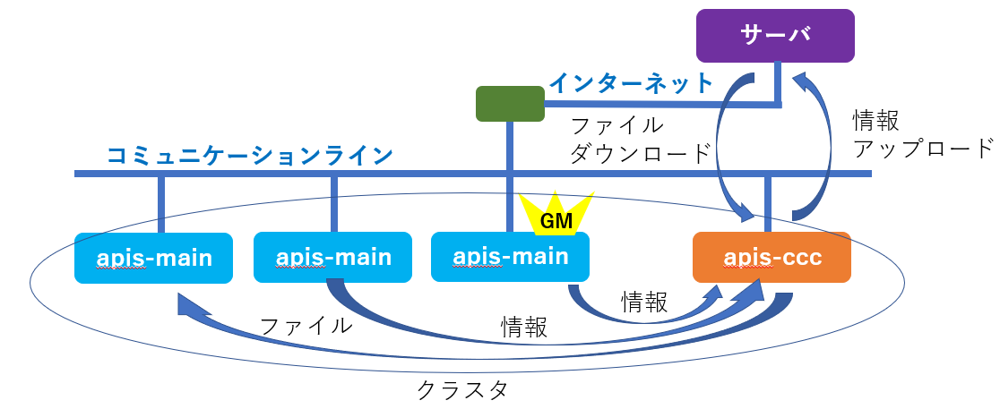
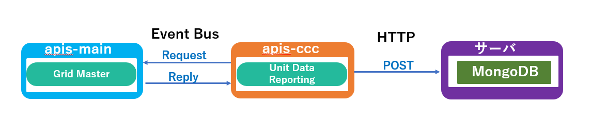
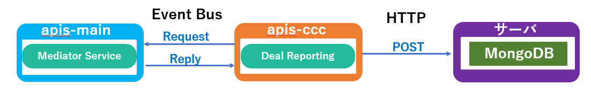
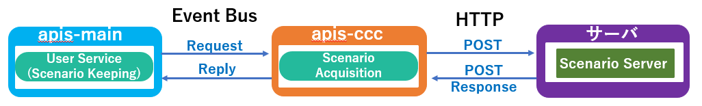
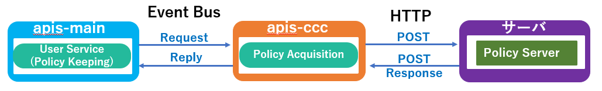

**apis-ccc Specification**
=====
**Rev 0.63**

# **目次**
- [**apis-ccc Specification Document**](#apis-ccc-specification-document)
- [**目次**](#目次)
- [**1. 用語・略語**](#1-用語略語)
- [**2. 概要**](#2-概要)
- [**3. ソフトウェア構成**](#3-ソフトウェア構成)
  - [**3.1. ソフトウェアアーキテクチャ**](#31-ソフトウェアアーキテクチャ)
  - [**3.2. ソフトウェア構成**](#32-ソフトウェア構成)
- [**4. 機能説明**](#4-機能説明)
  - [**4.1. Unit Data Reporting**](#41-unit-data-reporting)
  - [**4.2. Deal Reporting**](#42-deal-reporting)
  - [**4.3. Scenario Acquisition**](#43-scenario-acquisition)
  - [**4.4. Policy Acquisition**](#44-policy-acquisition)
- [**5. 収集情報**](#5-収集情報)
  - [**5.1. Unit Data Reporting取得情報**](#51-unit-data-reporting取得情報)
  - [**5.2. Deal Reporting取得情報**](#52-deal-reporting取得情報)
- [**6. 設定ファイルについて**](#6-設定ファイルについて)
  - [**6.1. config.json**](#61-configjson)
  - [**6.2. cluster.xml**](#62-clusterxml)
  - [**6.3. logging.properties**](#63-loggingproperties)
  - [**6.4. start.sh**](#64-startsh)
  - [**6.5. stop-kill.sh**](#65-stop-killsh)
  - [**6.6. key.pem**](#66-keypem)
  - [**6.7. cert.pem**](#67-certpem)
- [**7. Log出力**](#7-log出力)
  - [**7.1. Log Level**](#71-log-level)
  - [**7.2. APIS動作Log出力先**](#72-apis動作log出力先)
- [**8. 異常処理**](#8-異常処理)
- [**9. セキュリティ**](#9-セキュリティ)
  - [**9.1. APIS間通信セキュリティ**](#91-apis間通信セキュリティ)
- [**10. プライバシー**](#10-プライバシー)
- [**11. OSSライセンス**](#11-ossライセンス)
- [**12. 動作環境**](#12-動作環境)
  - [**12.1. ハードウェア要求**](#121-ハードウェア要求)
  - [**12.2. OS要求**](#122-os要求)

 

# **1. 用語・略語**

| **用語**           | **説明**                                                                                                 |
| ---------------- | ------------------------------------------------------------------------------------------------------ |
| apis-main        | 自律分散制御を可能にするSony CSLが開発した電力相互融通ソフトウェアである。(詳細はapis-main仕様書を参照。)                                         |
| Grid Master      | apis-mainに含まれるService名称でDC Gridを制御し電力融通を実現する。                                                          |
| Mediator Service | apis-mainに含まれるServiceの名称で他のapis-mianのMediator Serviceとネゴシエーションを行い、電力融通取引情報を作成するGrid Masterを起動させる役割も担う。 |
| Hazelcast        | 複数のマシンにDataを分散し並列処理を行うことでアプリケーションを高速化するインメモリ分散コンピューティング運用ライブラリである。                                     |
| Vert.x           | 負荷分散プログラムのフレームワーク。Hazelcastライブラリを利用してEvent Busをクラスタ化しネットワーク上で負荷分散処理を行う。                                |
| Event Bus        | Vert.xのプログラムの最小単位をVerticleと呼び。そのVerticle間でお互いに通信するための非同期インターフェースをEvent Busと呼ぶ。                         |
| Scenario         | apis-mainで使用されるJSON形式のファイルで電力融通のために必要なBattery残容量毎の充放電要求が記載されている。                                       |
| Policy           | apis-mainで使用されるJSON形式のファイルでシステム全体の秩序を維持するために必要な制御アルゴリズムとそのアルゴリズムを安全に実行するために必要なパラメータを設定する。              |

 

# **2. 概要**

apis-cccは運用保守等を目的として電力融通に関わる情報をサーバ等の外部Serviceにアップロードし、各ノードの設定ファイルをサーバからダウンロードするクライアントソフトウェアである。apis-cccはEthernet等のコミュニケーションラインに接続された複数のノード上のapis-mainから情報を取得するためにVert.x, Hazelcastのフレームワーク機能を用いてクラスタを構築する。そしてクラスタ内に存在するGrid Masterから全ノードのハードウェア情報、apis-mainに関係するソフトウェア情報、ノード固有情報等を取得し、任意のノードから電力融通情報を取得する。また、各apis-mainからの要求でサーバから設定ファイルをダウンロードする機能を有する。

  
図2-1

 

# **3. ソフトウェア構成**

## **3.1. ソフトウェアアーキテクチャ**

図3-1はapis-cccのソフトウェアアーキテクチャを示した図である。Linux OS上にJDK(Java Development Kit)、その上にイベントドリブンの負荷分散プラットフォームであるVert.xとインメモリ分散コンピューティングのHazelcastの2つのフレームワークを使用してapis-cccを動作させている。 (動作確認済みOSSソフトウェアのVersionは12. OSSライセンス参照)

  
図3-1

 

## **3.2. ソフトウェア構成**

apis-cccは図3-2で示すように以下の4つのServiceを提供する。

1)  Unit Data Reporting  
  一定時間毎にGrid Masterから全ノードのDC/DC ConverterやBattery等のハードウェア情報、apis-mainに関係するソフトウェア情報、ノード固有情報等を取得しサーバ等の外部Serviceに対してそれらの情報を送信するServiceである。

2)  Deal Reporting  
  一定時間毎にクラスタ内の任意のMediator Serviceから全電力融通情報を取得し、サーバ等の外部Serviceに対してそれらの情報を送信するServiceである。(Mediator Serviceの選定はVert.x が行う。)

3)  Scenario Acquisition  
  各apis-mainからの定期的なアクセスに従ってサーバ等の外部ServiceからScenarioファイルを取得し、要求元の各apis-mainに取得したScenarioファイルを送信するService である。

4)  Policy Acquisition  
  各apis-mainからの定期的なアクセスに従ってサーバ等の外部ServiceからPolicyファイルを取得し、要求元の各apis-mainに取得したPolicyファイルを送信するService である。

  
図3-2

 

# **4. 機能説明**
    
## **4.1. Unit Data Reporting**

apis-cccのServiceであるUnit Data ReportingはunitDataReporting.periodMsec (8.1 config.json参照)間隔毎にapis-mainのServiceであるGrid Masterに対してEvent Bus経由でRequestを送信することで、全ノードのハードウェア情報、ソフトウェア情報及びノード固有情報等をJSON形式で取得する。また、取得した情報はHTTPのPOSTメソッドを用いてJSON形式でサーバ等の外部Serviceに送信されMongoDBに保存される。(ハードウェア情報に関しては 7.1 Unit Data Reporting 取得情報参照)

  
図4-1

 

## **4.2. Deal Reporting**

apis-cccのServiceであるDeal ReportingはdealReporting.periodMsec (8.1 config.json参照)間隔毎にapis-mainのServiceであるMediator Serviceに対してEvent Bus経由でRequestを送信し全電力融通情報をJSON形式で取得する。また、取得した情報はHTTPのPOSTメソッドを用いてJSON形式でサーバ等の外部Serviceに送信されMongoDBに保存される。(Mediator ServiceはVert.xが指定し、指定されたMediator ServiceはHazelcastの共有メモリから全電力融通情報を取得しDeal Reportingに送信する)

Deal Reportingの定期処理とは別に、電力融通に参加したapis-mainのMediator Service が電力融通完了後にTriggerをかけてDeal Reportingを経由して電力融通完了情報をMongoDBに書き込む処理もある。

  
図4-2

 

## **4.3. Scenario Acquisition**

apis-mainのServiceであるUser Service内のScenario KeepingはScenarioファイルを取得するためにScenarioファイルに設定された間隔でapis-cccのServiceであるScenario Acquisitionに対してEvent Bus経由で自身のID等の情報と共にRequestを送信する。Requestを受け取ったScenario AcquisitionはHTTPのPOSTメソッドを用いてそれらの情報をサーバ等の外部Serviceに送信する。受け取ったサーバ等の外部ServiceはID等の情報に合致するJSON形式のScenarioファイルをHTTPのPOST ResponseとしてScenario Acquisitionに送信する。受け取ったScenario AcquisitionはEvent Bus経由でRequest元のScenario KeepingにJSON形式のScenarioファイルを送信する。

  
図4-3

 

## **4.4. Policy Acquisition**

apis-mainのServiceであるUser Service内のPolicy KeepingはPolicyファイルを取得するためにPolicyファイルに設定された間隔でapis-cccのServiceであるPolicy Acquisitionに対してEvent Bus経由で自身のID等の情報と共にRequestを送信する。Requestを受け取ったPolicy AcquisitionはHTTPのPOSTメソッドを用いてそれらの情報をサーバ等の外部Serviceに送信する。受け取ったサーバ等の外部ServiceはID等の情報に合致するJSON形式のPolicyファイルをHTTPのPOST ResponseとしてPolicy Acquisitionに送信する。受け取ったPolicy AcquisitionはEvent Bus経由でRequest元のPolicy KeepingにJSON形式のScenarioファイルを送信する。

(Policyファイルはクラスタ内で共通である必要があるため、各ノードのapis-mainがバラバラにPolicyファイルを変更することは避ける必要がある。機能としては実装されているが、使用に関しては管理者がクラスタ内の自動融通を一時停止するなどメンテナンス作業として実施する必要がある。)

  
図4-4

 

# **5. 収集情報**
    
## **5.1. Unit Data Reporting取得情報**

Unit Data ReportingがGrid MasterからEvent Bus経由で取得する各ノードのハードウェア情報は以下である。これらの情報を1セットとして全ノード分のハードウェア情報を取得できる。

<table>
<tbody>
<tr class="even">
<td rowspan="6">apis</td>
<td>version</td>
<td>apis-main version</td>
</tr>
<tr class="odd">
<td>remaining_capacity_wh</td>
<td>Battery残容量(Wh)</td>
</tr>
<tr class="even">
<td>deal_interlock_capacity</td>
<td>1融通 1スロットとした場合に、同時に融通可能なスロット数</td>
</tr>
<tr class="odd">
<td>operation_mode.global</td>
<td>
クラスタ全体のOperation Mode設定

autonomous : 通常の電力融通Mode

heteronomous : 既存電力融通継続

新電力融通生成無効

stop : 電力融通停止Mode

manual : 手動Mode (評価用)
</td>
</tr>
<tr class="even">
<td>operation_mode.local</td>
<td>
自ノードのOperation Mode設定

空 : operation_mode.globalに従う

heteronomous : 既存電力融通継続 新電力融通生成無効

stop : 電力融通停止Mode
</td>
</tr>
<tr class="odd">
<td>operation_mode.effective</td>
<td>
有効Operation Mode

globalとlocalのOperation Modeの組み合わせにて決定
</td>
</tr>
<tr class="even">
<td rowspan="10">oesunit</td>
<td>communityId</td>
<td>コミュニティID</td>
</tr>
<tr class="odd">
<td>clusterId</td>
<td>クラスタID</td>
</tr>
<tr class="even">
<td>id</td>
<td>ノードID</td>
</tr>
<tr class="odd">
<td>display</td>
<td>ノード名称</td>
</tr>
<tr class="even">
<td>sn</td>
<td>ノードシリアルNo.</td>
</tr>
<tr class="odd">
<td>budo</td>
<td>
旧システムでは自動融通がActiveになっていることを示すフラグだったが、現行システムではoperation_mode.effectiveがautonomousかそれ以外かを示すフラグとなっている。

autonomous : 1

それ以外 : 0
</td>
</tr>
<tr class="even">
<td>ip</td>
<td>IPv4</td>
</tr>
<tr class="odd">
<td>Ipv6_ll</td>
<td>IPv6リンクローカルユニキャスト</td>
</tr>
<tr class="even">
<td>Ipv6_g</td>
<td>IPv6グローバルユニキャスト</td>
</tr>
<tr class="odd">
<td>mac</td>
<td>MAC address</td>
</tr>
<tr class="even">
<td rowspan="2">battery</td>
<td>rsoc</td>
<td>相対残容量 (%)</td>
</tr>
<tr class="odd">
<td>battery_operation_status</td>
<td>電力融通許可/不許可フラグ</td>
</tr>
<tr class="even">
<td colspan="2">time</td>
<td>apis-mainノードの時間</td>
</tr>
<tr class="odd">
<td rowspan="21">dcdc</td>
<td>status.status</td>
<td>状態</td>
</tr>
<tr class="even">
<td>status.alarm</td>
<td>Alarm番号</td>
</tr>
<tr class="odd">
<td>status.stateAlarm</td>
<td>Alarm情報</td>
</tr>
<tr class="even">
<td>status.statusName</td>
<td>DC/DC Converter Status名称</td>
</tr>
<tr class="odd">
<td>status.runningState</td>
<td>DC/DC Converter動作 Status</td>
</tr>
<tr class="even">
<td>status.operationMode</td>
<td>Operation Mode</td>
</tr>
<tr class="odd">
<td>meter.wb</td>
<td>DC Grid 電力 (W)</td>
</tr>
<tr class="even">
<td>meter.vg</td>
<td>DC Grid電圧 (V)</td>
</tr>
<tr class="odd">
<td>meter.ig</td>
<td>DC Grid電流 (A)</td>
</tr>
<tr class="even">
<td>meter.wb</td>
<td>Battery電力 (W)</td>
</tr>
<tr class="odd">
<td>meter.vb</td>
<td>Battery電圧 (V)</td>
</tr>
<tr class="even">
<td>meter.ib</td>
<td>Battery電流 (A)</td>
</tr>
<tr class="odd">
<td>meter.tmp</td>
<td>内部温度 (℃)</td>
</tr>
<tr class="even">
<td>vdis.dvg</td>
<td>DC Grid目標電圧値 (V)</td>
</tr>
<tr class="odd">
<td>vdis.drg</td>
<td>DC Grid Droop率 (%)</td>
</tr>
<tr class="even">
<td>param.dig</td>
<td>DC Grid上限電流 (A)</td>
</tr>
<tr class="odd">
<td>param.ogv</td>
<td>DC Grid過電圧閾値 (V)</td>
</tr>
<tr class="even">
<td>param.ugv</td>
<td>DC Grid低電圧閾値 (V)</td>
</tr>
<tr class="odd">
<td>param.cib</td>
<td>Battery上限電流 (A)</td>
</tr>
<tr class="even">
<td>param.obv</td>
<td>Battery過電圧閾値 (V)</td>
</tr>
<tr class="odd">
<td>param.ubv</td>
<td>Battery低電圧閾値 (V)</td>
</tr>
</tbody>
</table>

 

## **5.2. Deal Reporting取得情報**

Deal Reportingが任意のMediator ServiceからEvent Bus経由で取得する全電力融通情報各ノードは以下である。これらの情報を1セットとして全電力融通分の情報を取得できる。

<table>
<tbody>
<tr class="even">
<td>unitId</td>
<td>ノード識別ID</td>
</tr>
<tr class="odd">
<td>negotiationId</td>
<td>電力融通交渉ID</td>
</tr>
<tr class="even">
<td>requestUnitId</td>
<td>電力融通をRequestしたノードID</td>
</tr>
<tr class="odd">
<td>acceptUnitId</td>
<td>電力融通をAcceptしたノードID</td>
</tr>
<tr class="even">
<td>requestDateTime</td>
<td>電力融通をRequestした日時</td>
</tr>
<tr class="odd">
<td>acceptDateTime</td>
<td>電力融通をAcceptした日時</td>
</tr>
<tr class="even">
<td>requestPointPerWh</td>
<td>Request側が提示した1Wh当たりのポイント</td>
</tr>
<tr class="odd">
<td>acceptPontPerWh</td>
<td>Accept側が提示した1Wh当たりのポイント</td>
</tr>
<tr class="even">
<td>requestDealGridCurrentA</td>
<td>Request側が提示した融通の電流値</td>
</tr>
<tr class="odd">
<td>acceptDealGridCurrentA</td>
<td>Accept側が提示した融通の電流値</td>
</tr>
<tr class="even">
<td>type</td>
<td>電力融通Requestのタイプ(充電/放電)</td>
</tr>
<tr class="odd">
<td>chargeUnitId</td>
<td>充電側のノードID</td>
</tr>
<tr class="even">
<td>dischargeUnitId</td>
<td>放電側のノードID</td>
</tr>
<tr class="odd">
<td>pointPerWh</td>
<td>実際の電力融通時の1Wh当たりのポイント</td>
</tr>
<tr class="even">
<td>chargeUnitEfficientGridVoltageV</td>
<td>充電側ノードの効率が良いGrid電圧</td>
</tr>
<tr class="odd">
<td>dischargeUnitEfficientGridVoltageV</td>
<td>放電側ノードの効率が良いGrid電圧</td>
</tr>
<tr class="even">
<td>dealGridCurrentA</td>
<td>電力融通時電流値(A)</td>
</tr>
<tr class="odd">
<td>requestAmountWh</td>
<td>Request側が提示した電力量</td>
</tr>
<tr class="even">
<td>acceptAmountWh</td>
<td>Accept側が提示した電力量</td>
</tr>
<tr class="odd">
<td>dealAmountWh</td>
<td>電力融通時電力量(Wh)</td>
</tr>
<tr class="even">
<td>dealId</td>
<td>電力融通情報に付与されたID</td>
</tr>
<tr class="odd">
<td>createDateTime</td>
<td>電力融通の電力融通情報が作られた日時</td>
</tr>
<tr class="even">
<td>
compensationTargetVoltage

ReferenceGridCurrentA
</td>
<td>電圧Referenceを担っているノードの電流補正のターゲット値 (A)</td>
</tr>
<tr class="odd">
<td>activateDateTime</td>
<td>Constant Voltageノード側の起動を開始した日時</td>
</tr>
<tr class="even">
<td>rampUpDateTime</td>
<td>DC Gridの電圧Ramp Upが完了した日時</td>
</tr>
<tr class="odd">
<td>warmUpDateTime</td>
<td>Constant Currentノード側を起動した日時</td>
</tr>
<tr class="even">
<td>
dischargeUnitCompensated

GridCurrentA
</td>
<td>電流補正後の放電電流 (A)</td>
</tr>
<tr class="odd">
<td>
chargeUnitCompensated

GridCurrentA
</td>
<td>電流補正後の充電電流 (A)</td>
</tr>
<tr class="even">
<td>startDateTime</td>
<td>実際の電力融通を開始した日時</td>
</tr>
<tr class="odd">
<td>cumulateDateTime</td>
<td>実際に電力融通した電力を積算した日時</td>
</tr>
<tr class="even">
<td>cumulateAmountWh</td>
<td>実際に電力融通した総電力量 (Wh)</td>
</tr>
<tr class="odd">
<td>stopDateTime</td>
<td>実際の電力融通を停止した日時</td>
</tr>
<tr class="even">
<td>deactiveateDateTime</td>
<td>電力融通後の処理が完了した日時</td>
</tr>
</tbody>
</table>

 

# **6. 設定ファイルについて**

apis-cccには複数の設定ファイルや鍵ファイル等が存在する。それらのファイルについて説明する。

## **6.1. config.json**

json形式のファイルでapis-cccの基本情報を設定する。起動時に一度だけ読み込まれるためパラメータを変更した場合はapis-cccの再起動が必要となる。

<table>
<tbody>
<tr class="even">
<td>programId</td>
<td>プログラム識別文字列</td>
</tr>
<tr class="odd">
<td>comminityId</td>
<td>コミュニティ識別文字列で1つ以上のクラスタをまとめる上位概念のID、clusterId及びAPIS Version文字列と共に暗号化のSeedとして用いられる</td>
</tr>
<tr class="even">
<td>clusterId</td>
<td>
クラスタ識別文字列

comminityId及びAPIS Version文字列と共に暗号化のSeedとして用いられる
</td>
</tr>
<tr class="odd">
<td>security.enabled</td>
<td>共有メモリ暗号化とEvent Bus SSL化の有効/無効設定</td>
</tr>
<tr class="even">
<td>security.pemKeyFile</td>
<td>Event Bus SSL化に使われる秘密鍵</td>
</tr>
<tr class="odd">
<td>security.pemCertFile</td>
<td>Event Bus SSL化に使われる証明書</td>
</tr>
<tr class="even">
<td>
dealReporting.

periodMsec
</td>
<td>電力融通情報をサーバ等の外部サービスへ通知する周期</td>
</tr>
<tr class="odd">
<td>dealReporting.host</td>
<td>電力融通情報を送るサーバ等の外部サービスのIP Address</td>
</tr>
<tr class="even">
<td>dealReporting.port</td>
<td>電力融通情報を送るサーバ等の外部サービスのPort番号</td>
</tr>
<tr class="odd">
<td>dealReporting.ssl</td>
<td>
電力融通情報を送るサーバ等の外部サービス通信SSL

&emsp;有効 : true

&emsp;無効 : false
</td>
</tr>
<tr class="even">
<td>dealReporting.uri</td>
<td>電力融通情報を送るサーバ等の外部サービスの通知URI</td>
</tr>
<tr class="odd">
<td>
dealReporting.request

TimeoutMsec
</td>
<td>電力融通情報を送るサーバ等の外部サービスのHTTP Requestタイムアウト時間</td>
</tr>
<tr class="even">
<td>
unitDataReporting

.periodMsec
</td>
<td>ハードウェア情報をサーバ等の外部サービスへ通知する周期</td>
</tr>
<tr class="odd">
<td>unitDataReporting.host</td>
<td>ハードウェア情報を送るサーバ等の外部サービスのIP Address</td>
</tr>
<tr class="even">
<td>unitDataReporting.port</td>
<td>ハードウェア情報を送るサーバ等の外部サービスのPort番号</td>
</tr>
<tr class="odd">
<td>unitDataReporting.ssl</td>
<td>
ハードウェア情報を送るサーバ等の外部サービス通信SSL

&emsp;有効 : true

&emsp;無効 : false
</td>
</tr>
<tr class="even">
<td>unitDataReporting.uri</td>
<td>ハードウェア情報を送るサーバ等の外部サービスの通知URI</td>
</tr>
<tr class="odd">
<td>
unitDataReporing.

requestTimeoutMsec
</td>
<td>ハードウェア情報を送るサーバ等の外部サービスのHTTP Requestタイムアウト時間</td>
</tr>
<tr class="even">
<td>scenarioAcquisition.host</td>
<td>Scenarioファイルを取得するサーバ等の外部サービスのIP Addres</td>
</tr>
<tr class="odd">
<td>scenarioAcquisition.port</td>
<td>Scenarioファイルを取得するサーバ等の外部サービスのPort番号</td>
</tr>
<tr class="even">
<td>scenarioAcquisition.ssl</td>
<td>
Scenarioファイルを取得するサーバ等の外部サービス通信SSL

&emsp;有効 : true

&emsp;無効 : false
</td>
</tr>
<tr class="odd">
<td>scenarioAcquisition.uri</td>
<td>Scenarioファイルを取得するサーバ等の外部サービスの通知URI</td>
</tr>
<tr class="even">
<td>
scenarioAcquisition.

requestTimeoutMsec
</td>
<td>Scenarioファイルを取得するサーバ等の外部サービスのHTTP Requestタイムアウト時間</td>
</tr>
<tr class="odd">
<td>policyAcquisition.host</td>
<td>Policyファイルを取得するサーバ等の外部サービスのIP Address</td>
</tr>
<tr class="even">
<td>policyAcquisition.port</td>
<td>Policyファイルを取得するサーバ等の外部サービスのPort番号</td>
</tr>
<tr class="odd">
<td>policyAcquisition.ssl</td>
<td>
Policyファイルを取得するサーバ等の外部サービス通信SSL

&emsp;有効 : true

&emsp;無効 : false
</td>
</tr>
<tr class="even">
<td>policyAcquisition.uri</td>
<td>Policyファイルを取得するサーバ等の外部サービスの通知URI</td>
</tr>
<tr class="odd">
<td>
policyAcquisition.request

TimeoutMsec
</td>
<td>Policyファイルを取得するサーバ等の外部サービスのHTTP Requestタイムアウト時間</td>
</tr>
<tr class="even">
<td>watchdog.periodMsec</td>
<td>Watch Dog Reset周期　(ms)</td>
</tr>
<tr class="odd">
<td>watchdog.host</td>
<td>Watch DogがperiodMsec間隔でAccessするIP Address</td>
</tr>
<tr class="even">
<td>watchdog.port</td>
<td>Watch DogがperiodMsec間隔でAccessするPort番号</td>
</tr>
<tr class="odd">
<td>watchdog.uri</td>
<td>Watch DogサービスのURI</td>
</tr>
<tr class="even">
<td>
watchdog.request

TimeoutMsec
</td>
<td>Watch DogのTimeout時間(ms)</td>
</tr>
</tbody>
</table>

 

## **6.2. cluster.xml**

xml形式のファイルでHazelcastがクラスタを構築する際に必要なパラメータ(クラスタ名称、パスワード、ネットワーク設定、マルチキャスト設定等)を設定する。

暗号化しcluster.xml.encrypted として保存される。

 

## **6.3. logging.properties**

Javaの標準APIであるjava.util.loggingのLogの出力に関する設定(Logファイルの保存先、Log の保存容量、Log Levelの設定等)が記述されているファイル。

 

## **6.4. start.sh**

apis-cccを起動させるスクリプトファイル。OS起動時の自動実行で実行される。  
以下にstart.sh内でのapis-cccを起動させるコマンドを示す。  

 

> java -Djava.net.preferIPv4Stack=true -Duser.timezone=Asia/Tokyo -Djava.util.logging.config.file=./logging.properties -jar ./apis-ccc-2.23.0-a01-fat.jar -conf ./config.json -cp ./ -cluster -cluster-host 127.0.0.1 &  

 

“java”の後の引き数の意味を以下に説明する。  
* Djava.net.preferIPv4Stack=true  
 → IPv4アドレスにバインドして起動するオプション。

* Duser.timezone=Asia/Tokyo  
 → Timezone設定。

* Djava.util.logging.config.file=./logging.properties  
 → Log構成ファイルを指定するオプション。

* jar ./apis-ccc-2.23.0-a01-fat.jar  
 → JARファイルの中にカプセル化されたプログラムの実行を指定するオプション。

* conf ./config.json  
 → 構成ファイルを指定するオプション。

* cp ./  
 → cluseter.xmlファイルの位置を指定するオプション。

* cluster-host 127.0.0.1  
 → 自身のIP Addressを指定するオプション。

 

## **6.5. stop-kill.sh**

apis-cccを停止させるスクリプトファイル。  
Event Bus経由のShutdown機能(stop)を実施した後、それがタイムアウトした場合に自身のJavaプロセスを強制終了させる処理を行う。スクリプトの中でタイムアウトを秒で指定することが可能である。

 

## **6.6. key.pem**

Event BusのSSL化に使われる秘密鍵である。

 

## **6.7. cert.pem**

Event BusのSSL化に使われる証明書である。

# **7. Log出力**
    
## **7.1. Log Level**

Log出力にはJava標準APIのjava.util.loggingを使っており以下の7つのLevelに分類されている。APISとしては”CONFIG”, “FINER”のLevelは使用しない。これらのAPISの動作Logはlogging.propertiesファイルに記載することでLogファイルの保存先、保存するLog Level、最大Logサイズ、最大保存Log数等の設定を行っている。

 

\[java.util.logging Log Level\]

1. SEVERE  
  * 実行中にErrorが発生した場合に使われるLevelである。  
  このLevelのLogが出力された場合には何等かの不具合が発生したと考えられる。
     * \<例\> サーバ等の外部Serviceとの通信が失敗した場合。

2. WARNING  
  * 実行中にErrorではないが期待された動作でないため警告として知らせる目的で使われるLevelである。
    * \<例\> Grid Masterから取得した各ノードのハードウェア情報等が空の場合。

3.  INFO
  * 実行中の正常系の情報を出力する際に用いられるLevelで、apis-cccでは特に動作として重要なイベント処理を行った際に使われる。  
    * \<例\> サーバ等の外部Serviceとの接続情報

4. CONFIG  
  * 設定に関するLog Levelであるがapis-cccとしてはこのLevelの出力は行わない。

6. FINE  
  * 実行中の正常系の通常動作情報を出力する際に用いられるLevelである。
    * \<例\>サーバ等の外部Serviceに通知する情報

6. FINER
  * 特定の処理についての開始及び終了の情報であるがapis-cccとしてはこのLevelの出力は行わない。

7. FINEST  
  * 実行中の正常系の通常動作情報を出力する際に用いられるLevelである。
    * \<例\> Vert.xのVerticle起動時等。

 

## **7.2. APIS動作Log出力先**

apis-cccの動作LogはUDP、Console、ファイルの3つの出力先がある。logging.propertiesの設定でそれぞれの出力の有無や前頁で述べた出力Levelの制限をかけることができる。UDPはコミュニケーションラインに出力されるため情報漏洩や通信のトラフィックを考慮して設定し、ファイルへの出力は不揮発性メモリの容量を考慮して設定する。

 

# **8. 異常処理**

不具合が発生するとFile, UDP, ConsoleにLogは出力するが、自らをリセットしたり、停止させたりする機能はない。

 

# **9. セキュリティ**
    
## **9.1. APIS間通信セキュリティ**

apis-ccc - Grid Master間のやり取りはVert.x, Hazelcasフレームワーク がサポートするEvent Bus通信とHazelcast通信によって行われている。それぞれの通信ではセキュリティのため以下の方法で暗号化を行っている。

(1) Event Bus通信

* SSL公開鍵暗号方式 (RSA)

* SSL自己署名証明書

(2) Hazelcast通信

* 共通鍵暗号方式(AES 128bit)

 

# **10. プライバシー**

apis-ccc経由で取得できる情報が、個人情報に該当するかは導入地域によって異なるため確認が必要である。また、個人情報に該当する場合で、持ち主の許可なく外部のサーバに送信する行為はGDPR等の個人情報保護規制の対象になる可能性があるため注意が必要である。

 

# **11. OSSライセンス**

以下にapis-cccが使用するソフトウェアとそのOSSライセンスの情報を記載する。apis-cccで使用するAdopt OpenJDKはライブラリのリンクのみを行っているためClasspath Exceptionが適用されGPLv2であってもapis-cccのソースコードの公開を要求されない。その他のOSSソフトウェアもapis-cccのソースコードの公開を要求するライセンスはない。

■apis-cccで使用されるソフトウェアとそのOSSライセンス情報

<table>
<thead>
<tr class="header">
<th>ソフトウェア</th>
<th>バージョン</th>
<th>ライセンス</th>
<th>コード改変</th>
</tr>
</thead>
<tbody>
<tr class="odd">
<td>Adopt OpenJDK</td>
<td>11.0.4+11</td>
<td>GPLv2 with Classpath Exception</td>
<td>無</td>
</tr>
<tr class="even">
<td>Vert.x</td>
<td>3.7.1</td>
<td>
デュアルライセンス(以下選択)

Eclipse Public License2.0

Apache License2.0
</td>
<td>無</td>
</tr>
<tr class="odd">
<td>Hazelcast</td>
<td>3.6.3</td>
<td>Apache License2.0</td>
<td>無</td>
</tr>
<tr class="even">
<td>Netty</td>
<td>4.1.8</td>
<td>Apache License2.0</td>
<td>無</td>
</tr>
<tr class="odd">
<td>FasterXML/Jackson</td>
<td>2.7.4</td>
<td>Apache License2.0</td>
<td>無</td>
</tr>
</tbody>
</table>

※諸事情によりソフトウェアバージョンは変更される可能性があります。

 

# **12. 動作環境**
    
## **12.1. ハードウェア要求**

以下にapis-cccのハードウェア要求を示す。

<table>
<tbody>
<tr class="even">
<td>CPUプロセッサ</td>
<td>
600～1000MHz, 64bit シングルコア, 32KB L1 cache以上

ARMv8推奨

(ARMv8以外のCPU採用の場合はAPISの動作確認を行う必要あり)
</td>
</tr>
<tr class="odd">
<td>DRAM</td>
<td>DDR3 1.6Gbps 1GB 以上</td>
</tr>
<tr class="even">
<td>内部ストレージ</td>
<td>8GB以上</td>
</tr>
<tr class="odd">
<td>イーサネット</td>
<td>20Mbps 1ポート以上, IPv4 IPv6 サポート</td>
</tr>
</tbody>
</table>

 

## **12.2. OS要求**

以下にapis-ccc用IoT BoardのOS要求を示す。

<table>
<tbody>
<tr class="even">
<td>種類</td>
<td>
64bit OS, Linux 推奨

(Linux以外のOSの場合には採用前にAPIS動作確認を行う必要あり)
</td>
</tr>
<tr class="odd">
<td>サイズ</td>
<td>
IoT Boardの内部ストレージ容量次第

(APIS等のLog保存場所用に3GB以上は確保すること)
</td>
</tr>
<tr class="even">
<td>動作ソフトウェア</td>
<td>AdoptOpenJDK (32/64bit)</td>
</tr>
<tr class="odd">
<td>OSSライセンス</td>
<td>GPL等のコピーレフト型ライセンスの影響を避けるため、それらのライセンスを持つソフトウェアとapis-cccが1つの実行ファイルとなるOSは禁止 (例:RTOS)</td>
</tr>
<tr class="even">
<td rowspan="5">その他</td>
<td>OS起動時にapis-ccc等の自動実行が行えること</td>
</tr>
<tr class="odd">
<td>ssh login/scpファイル転送が行えること</td>
</tr>
<tr class="even">
<td>logrotage等でログを定期的にリネーム/圧縮/削除が行えること</td>
</tr>
<tr class="odd">
<td>IPv4アドレスを固定できること</td>
</tr>
<tr class="even">
<td>ntp serverと時間の同期が行えること</td>
</tr>
</tbody>
</table>

 
